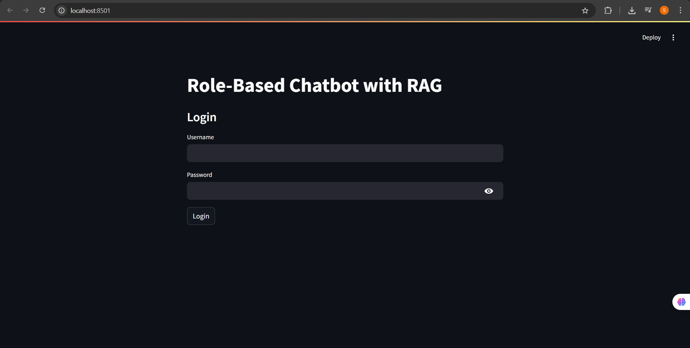
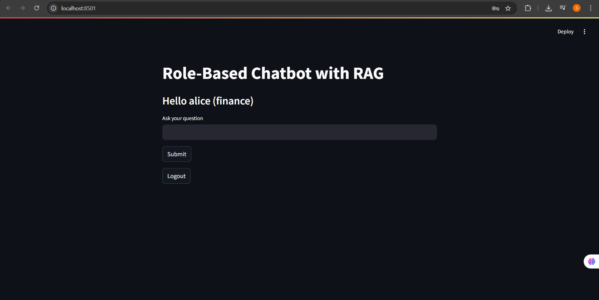

# 📄 README: Role-Based RAG Chatbot for FinSolve Technologies

## 🚀 Project Overview

This project is a **Role-Based Access Control (RBAC) Chatbot** built for FinSolve Technologies, a leading FinTech company.
It solves the challenge of **communication delays and data silos** across departments by providing secure, role-specific insights using a **RAG (Retrieval Augmented Generation) pipeline**.

The chatbot ensures that each user accesses only the data permitted for their role while leveraging **Groq’s Llama-3 API** for generating context-rich responses.

---

## 🛠️ Tech Stack

- **Backend:** FastAPI (Python)
- **Frontend:** Streamlit
- **Vector Database:** ChromaDB
- **LLM API:** Groq API (Llama-3 models)
- **Authentication:** Username-based login with role-based session management

---

## 🌟 Key Features

- ✅ Role-Based Access Control (RBAC)
- ✅ Authentication and Role Assignment
- ✅ Secure role-specific data access
- ✅ Retrieval Augmented Generation (RAG) using ChromaDB
- ✅ Natural Language Processing with Groq Llama-3 API
- ✅ Session management with login and logout
- ✅ Responsive Streamlit-based chatbot UI

---

## 🗂️ Roles and Permissions

| Role               | Access                                                                 |
| ------------------ | ---------------------------------------------------------------------- |
| Finance Team       | Financial reports, marketing expenses, equipment costs, reimbursements |
| Marketing Team     | Campaign performance data, customer feedback, sales metrics            |
| HR Team            | Employee data, attendance records, payroll, performance reviews        |
| Engineering Team   | Technical architecture, development processes, operational guidelines  |
| C-Level Executives | Full access to all company data                                        |
| Employee           | General company information (policies, events, FAQs)                   |

---

## 📸 Project Screenshots





---

## ⚙️ Project Setup

### 1. Clone the Repository

```bash
git clone <repository-url>
cd <project-folder>
```

### 2. Install Dependencies

```bash
pip install -r requirements.txt
```

### 3. Set Up Environment Variables

Create a `.env` file in the project root:

```ini
GROQ_API_KEY=sk-your-groq-api-key
```

### 4. Prepare Vector Database

- Store your role-based documents inside the folder:

```text
backend/data/
├── finance
├── marketing
├── hr
└── ...
```

- Run the document ingestion script to load the data:

```bash
python backend/load_documents.py
```

### 5. Run the Backend (FastAPI)

```bash
uvicorn backend.main:app --reload
```

### 6. Run the Frontend (Streamlit)

```bash
streamlit run frontend/app.py
```

---

## 📝 How to Use

1. Open the Streamlit app in your browser.
2. Log in with your username (role is automatically assigned).
3. Ask queries related to your department’s data.
4. The chatbot retrieves relevant documents and generates answers using Groq’s Llama-3 API.
5. Click **Logout** to securely end your session.

---

## 🚧 Known Limitations

- Currently uses **username-based authentication only.** Advanced security like password hashing can be added.
- Requires sufficient balance on the **Groq API** for continuous operation.

---

## 📂 Project Folder Structure

```text
├── backend
│   ├── main.py             # FastAPI server
│   ├── rag.py              # RAG logic with Groq API
│   ├── vector_store.py     # ChromaDB integration
│   ├── load_documents.py   # Data ingestion script
│   ├── data                # Role-based document folders (Finance, Marketing, HR, etc.)
│   │    ├── finance
│   │    ├── marketing
│   │    ├── hr
│   │    └── ...
├── frontend
│   └── app.py              # Streamlit chatbot UI
├── .env                    # API keys (excluded from Git)
├── requirements.txt
└── README.md
```

---

## ✅ Future Improvements

- Add token-based authentication and password encryption.
- Implement streaming responses from Groq API.
- Add multi-page navigation with `st.switch_page`.
- Build a fallback system for API failure handling.

---

## ✨ Credits

Developed by **Samyak Jain**
Challenge by [CodeBasics.io](https://codebasics.io/challenge/codebasics-gen-ai-data-science-resume-project-challenge)
